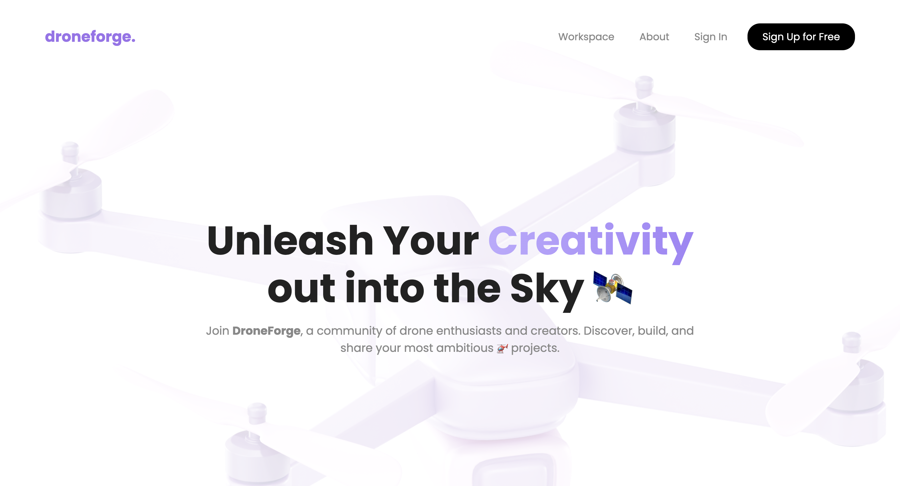
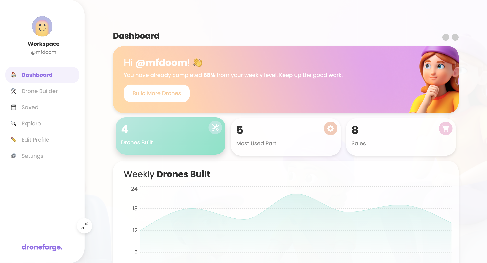

<div align="center">

# 🚁 droneforge.

</div>

## 🛠️ About the project

DroneForge is a comprehensive web application developed as part of the web programming curriculum in the Computer Science degree at Universidade da Beira Interior. This project is designed to facilitate drone assembly and provide users with detailed statistics and insights. Built using modern web technologies, DroneForge leverages the power of React for building the user interface, Bootstrap for responsive design, Node.js for server-side logic, and MongoDB for database management.

### Key Features

- **Drone Assembly**: Users can assemble custom drones by selecting various components and configurations.
- **User Statistics**: The application provides detailed statistics and insights on user activity and drone configurations.
- **Responsive Design**: The use of React and Bootstrap ensures that the application is accessible and user-friendly across different devices.
- **Modern Technology Stack**: The backend is powered by Node.js and MongoDB, providing a robust and scalable architecture for the application.

DroneForge is a practical implementation of web programming concepts, showcasing the integration of front-end and back-end technologies to create a seamless user experience. It is an excellent demonstration of the skills and knowledge acquired during the Computer Science program at Universidade da Beira Interior.

## 👀 Preview of the project




> These are some preview images of the website.

## 💻 Pré-requisits

Before starting check for this requisits:

- You must have `<npm>` installed.

## 🚀 To get the project up and running

Follow these steps:

### Linux and macOS:

1. Install the necessary dependencies:
    ```bash
    npm install
    cd droneforge
    npm install
    cd ../droneforge-backend
    npm install
    cd ..
    ```

2. Start the application:
    ```bash
    cd droneforge
    npm start
    cd ../droneforge-backend
    npm start
    ```

### Windows:

1. Install the necessary dependencies:
    ```cmd
    npm install
    cd droneforge
    npm install
    cd ../droneforge-backend
    npm install
    cd ..
    ```

2. Start the application:
    ```cmd
    cd droneforge
    npm start
    cd ../droneforge-backend
    npm start
    ```

## ☕ Using the project

To use <nome_do_projeto>, follow these steps:

1. Navigate to the main project directory and install dependencies:
    ```bash
    npm install
    ```

2. Navigate to the `droneforge` directory and start the application:
    ```bash
    cd droneforge
    npm start
    ```

3. In another terminal window, navigate to the `droneforge-backend` directory and start the backend server:
    ```bash
    cd droneforge-backend
    npm start
    ```

Make sure you have both the frontend and backend running to use the application effectively.

## 🤝 Colaborators

All thanks to these two bozos:

<table>
  <tr>
    <td align="center">
      <a href="https://github.com/diogogomesaraujo" title="defina o titulo do link">
        <br>
        <sub>
          <b>Diogo Araújo</b>
        </sub>
      </a>
    </td>
    <td align="center">
      <a href="https://github.com/DiogoRodriguesz" title="defina o titulo do link">
        <br>
        <sub>
          <b>Diogo Rodrigues</b>
        </sub>
      </a>
    </td>
  </tr>
</table>

## 📝 License

This project is under license. Check the file [License](LICENSE.md) for more details.
